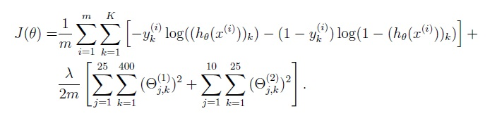
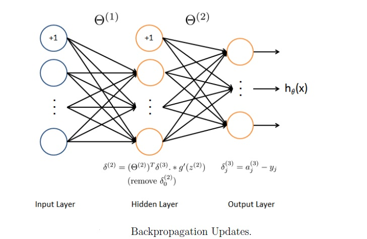

# Handwritten-Digit-Recognizer

Neural Network from scratch in Python to recognize handwritten digit achieved  98.45% test accuracy and using Keras CNN(Convolutional neural network) achieved  99.25% test accuracy deployed model to production

# Dataset

# Deep Neural network (DNN)

## Model representation
Implemented Neural network has 3 layers an input layer,a hidden layer and an output layer.

## Feedforward and Regularized Cross entropy cost function
Implementation of DNN includes code for Feedforward and Regularized Cross entropy cost function

## Backpropagation
Implementation of DNN includes code for Backpropagation

# Technologies 
* Python
* Numpy for data cleaning
* Matplotlib & Seaborn for data visualization
* keras for model building
* Python flask for HTTP server
* HTML/CSS/Javascript for UI

©SyedMuhammadHamza Licensed under [MIT License](https://github.com/SyedMuhammadHamza/Handwritten-Digit-Recognizer/blob/main/LICENSE)
